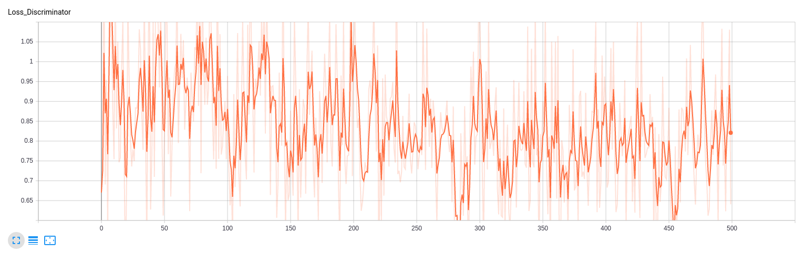
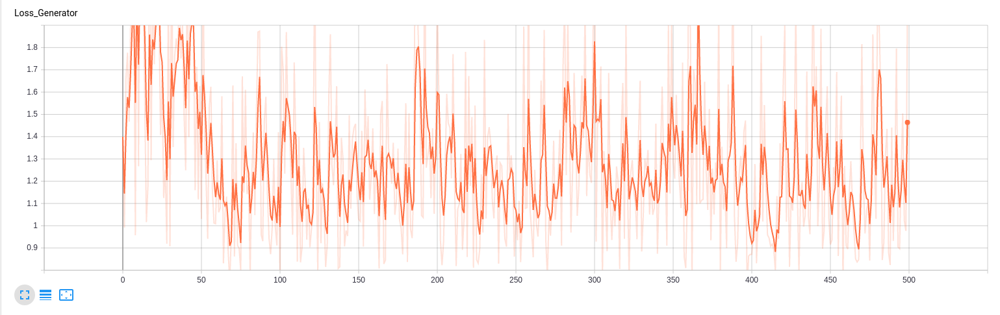

# CapsVoxGAN

## Introduction

My project aimed to be a three dimensional generative adversarial network (GAN) for generating voxel models, using a three dimensional [capsule network](http://papers.nips.cc/paper/6975-dynamic-routing-between-capsules).

### Setup
In order to make my development environment portable, I used [Miniconda](https://docs.conda.io/en/latest/miniconda.html). Just download and install it, then use [environment.yml](environment.yml) to replicate my environment: ```conda env create --file environment.yml```

Once the environment is set-up, a dataset for training has to be created: just run ```python create_dataset.py```, it will download the dataset and convert it from the MATLAB file format into NumPy and saves it as one compressed [HDF5](https://www.hdfgroup.org/solutions/hdf5/) file.

### Usage
Once the setup is done, just run ```python gan.py``` to start training the GAN.

To see the trained models, run ```jupyter notebook visualise.ipynb```. It uses [Matplotlib](https://matplotlib.org/) and [Plotly](https://plot.ly/) to display training and generated voxel models. 

### Files

* [capsule.py](capsule.py): implementation of the capsule network (doesn't work unfortunately)
* [constants.py](constants.py): definition of used constants
* [create_dataset.py](create_dataset.py): downloads the dataset and converts it into a single HDF5 file
* [environment.yaml](environment.yml): Miniconda evironment 
* [gan.py](gan.py): the main file 
* [old_readme.md](old_readme.md): former README.md, laying down the vision for this project
* [README.md](README.md): this file
* [visualise.ipynb](visualise.ipynb): visualises the voxel models
* [voxeldata.py](voxeldata.py): data loader for the training data

## Results

The capsule network does not work (for now). As I wrote at the end of [exercise 1](old_readme.md): I am aware that this was quite a big undertaking, and that I'm more doing it for the journey than the goal. The code for the capsule networks is still a bit "hacky", it runs, but it does not work: there is little to no improvement on the simple test case, I used it on (during 30 epochs).  

However, since I do need something to show, I trained a GAN, with regular three-dimensional CNNs on voxel data. In order to train the GAN within reasonable time, I only used four different classes:
* wardrobe
* bed
* chair
* laptop

All generated models can be found at: https://cloud.tugraz.at/index.php/s/F8L9BwiXznP3FrL

Here are a few examples of the generated models:

##### After 0 epochs:

Initially the generator only produces random noise, because of the threshold value of 0.9, only a few pictures are shown.


##### After 40 epochs:

After 40 epochs the output resembles like a chair, but it is missing some important features. 


##### After 140 epochs:

After 100 more epochs, the generator generates something, that looks like a mixture between chair and table.


##### After 220 epochs:

This example looks like the upper part of a chair.


##### After 350 epochs:

After 350 epochs the generator is again generating chairs, this one is overall one of the best generated models. 


##### After 490 epochs:

The generated model after many more epochs looks again like a chair, but this one has some quirks to it.


  

## Error Metric

I am using Binary Cross Entropy Loss (BCELoss), since I want to measure the error of a reconstruction. I measure the loss for the discriminator in distinguishing real from generated examples, and sum up both losses. For the generator, I'm interested in how well the generator is able to fool the discriminator. 

The target values for both of them is of course as small as possible (>> 1) and to be constantly getting smaller. Since this is GAN working with 3D data, this did not work out:

##### Loss Function for the Discriminator



##### Loss Function for the Generator

  

## Work-Breakdown:

Task | Hours
--- | ---
Getting familiar with the data / used libraries | 10
In-depth reading of related publications | 15
Coding of solution | 40
Creating presentation of results | 8

## Acknowledgment

The code for the Voxel-GAN is based on [3DGAN-Pytorch](https://github.com/rimchang/3DGAN-Pytorch) from @rimchang.

The code for the Capusle Network is based on [3D Point Capsule Networks](https://github.com/yongheng1991/3D-point-capsule-networks) by @yongheng1991
